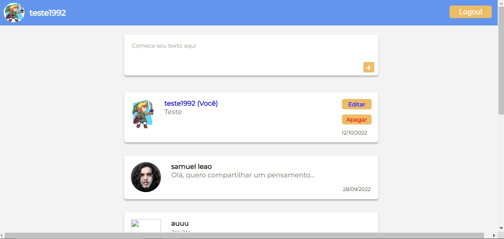

<h1>💻 BLOG CHAT</h1>

 

O blog chat é uma aplicação que simula um microblog onde os usuários podem interagir em fila e visualizar o histórico de comentários de todas as pessoas que fizeram alguma postagem. Na aplicação, o usuário deve estar cadastrado e logado para poder ver e postar alguma coisa, do contrário, uma página anômima é apresentada.
 

<h1>🔨 RECURSOS</h1>

<ul>
<li><strong>Cadastro:</strong> para utilizar a aplicação é necessário realizar cadastro.</li>
<li><strong>Login:</strong> o usuário cadastrado pode realizar login.</li>
<li><strong>Logout:</strong> o usuário cadastrado pode sair da aplicação.</li>
<li><strong>Perfil:</strong> o usuário logado pode visualizar sua foto de perfil e realizar postagens.</li>
<li><strong>Postagem:</strong> é possível postar um texto, editá-lo e excluí-lo, sem afetar as postagens dos demais usuários.</li>
<li><strong>Visualização:</strong> é possível ver o que os demais usuários postaram.</li>
<li><strong>Paginação:</strong> é possível navegar pelo histórico de postagens do microblog.</li>
<li><strong>Modo anômino:</strong> é possível ver a estrutura da aplicação sem estar logado</li>
</ul> 

<h1>🚀 TECNOLOGIAS</h1>

<ul>
<li>JAVASCRIPT</li>
<li>HTML</li>
<li>CCS</li>
<li>POO</li>
</ul> 

<h1>🔗 LINK</h1>

<a href="https://project-js-blog-chat.vercel.app/" target="_blank">LINK PARA O BLOG CHAT</a>
